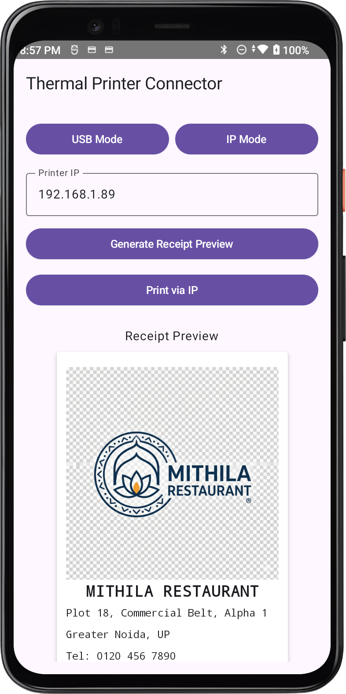
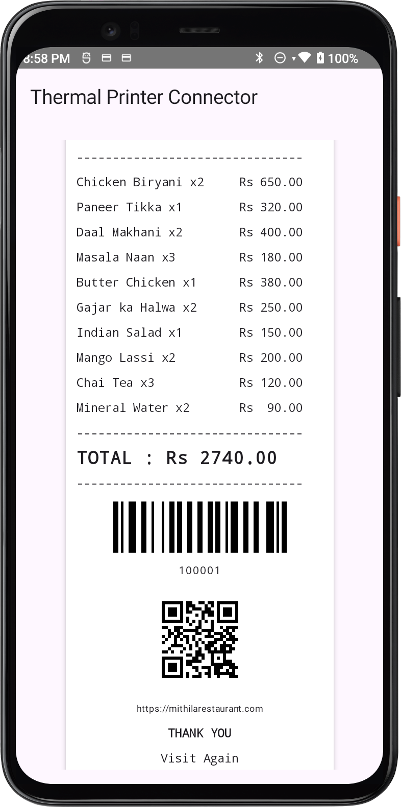

# ThermalPrinterConnector

An Android library and sample application for seamless integration with ESC/POS thermal printers via USB and Network (TCP/IP) connections. It provides a structured "Receipt Builder" DSL, a real-time Compose-based previewer, and a robust command generator to handle text formatting, images, barcodes, and QR codes.

---

## Preview
| Receipt Header | Barcode & QR Code Rendering |
| :---: | :---: |
|  |  |

---

## Overall Objective
The goal of this project is to simplify the complex process of communicating with thermal receipt printers. Instead of manually handling byte arrays and ESC/POS hex codes, developers can define a receipt as a collection of high-level elements (Text, Images, Barcodes). The system then automatically translates these elements into the specific low-level commands required by the printer hardware and handles the underlying transport logic (finding USB devices or opening Network sockets).

---

## Printing Flow Execution
1.  **Define Content**: Use `ReceiptBuilder` to create a `ReceiptDocument` containing elements like `Text`, `Image`, `Barcode`, or `QrCode`.
2.  **Preview**: (Optional) Use `ReceiptPreviewScreen` to render a visual representation of the receipt in the UI.
3.  **Command Generation**: `PrinterManager` uses `EscPosCommandBuilder` to iterate through the document and translate high-level elements into raw ESC/POS byte sequences.
4.  **Hardware Handshake**: `PrinterManager` triggers the selected `PrinterTransport` (USB or Socket) to establish a connection.
5.  **Data Transmission**: The raw bytes are streamed to the hardware via bulk transfer (USB) or output streams (Socket).
6.  **Completion**: The printer executes commands (print, feed, cut), and the transport is disconnected.

---

## Detailed Class Breakdown

### 1. Core Logic & Management
*   **`PrinterManager`**: The "brain" of the operation. Orchestrates validation, command building, and transport execution. Handles safety checks like payload size limits.
*   **`ReceiptBuilder`**: A high-level builder class that allows constructing complex receipts using a simple, readable API.

### 2. Models (The "What" to Print)
*   **`ReceiptDocument`**: The primary data structure containing a list of `ReceiptElement`s.
*   **`ReceiptElement`**: A sealed class hierarchy representing printable components:
    *   `Text`: Supports alignment, bolding, underlining, and double-size scaling.
    *   `Image`: Supports monochrome bit-image printing from standard bitmaps.
    *   `Barcode` / `QrCode`: Generates printer-native scannable codes.
    *   `Feed`: Directs paper movement.
*   **`ReceiptStyle` / `ReceiptAlignment`**: Enumerations and data classes for controlling text layout and typography.

### 3. ESC/POS Generation (The "Translator")
*   **`EscPosCommandBuilder`**: The protocol implementation. Converts high-level models into the raw hex commands understood by the printer hardware.
*   **`EscPosImageHelper`**: Specialized logic to convert Android `Bitmap`s into the specific 1-bit vertical-bit-mapping format used by ESC/POS commands.
*   **`EscPosBarcodeGenerator` / `EscPosQrGenerator`**: Helpers for formatting data into standardized barcode and QR code byte sequences.

### 4. Transports (The "How" to Send)
*   **`PrinterTransport` (Interface)**: The abstraction layer for hardware communication.
*   **`UsbPrinterTransport`**: Implements USB Host communication, handling device discovery, permissions, and bulk transfers.
*   **`SocketPrinterTransport`**: Implements TCP/IP communication for network printers (typically on port 9100).

### 5. UI Components
*   **`ReceiptPreviewScreen`**: A Compose-based viewer that mimics the final printed result, allowing users to verify content before physical printing.
*   **`PrinterControlScreen`**: The main user interface for configuring printer connections and triggering test prints.
